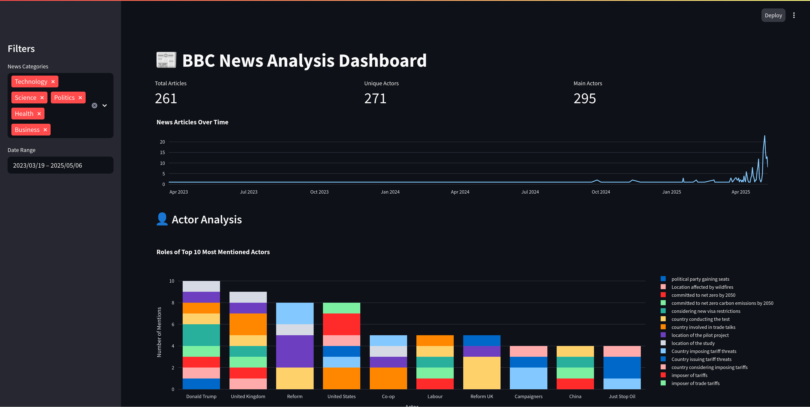
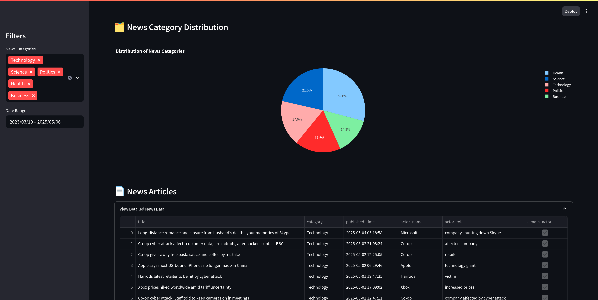

# News Insights - AI-Powered News Analysis with PyArrow Acero and Delta Lake

<p align="center">
  
</p>

A proof of concept for collecting, processing, and analyzing news articles using AI and modern data technologies. Built on top of `PyArrow Acero` for streaming data processing, `Delta Lake` for efficient data storage, and `OpenAI's GPT models` for advanced text analysis.

## Key Features
- **Real-time News Collection**: Automated RSS feed collection from BBC News with extensible architecture
- **AI-Powered Analysis**: Named entity extraction using OpenAI's GPT models (actor, role, category)
- **Efficient data management**: PyArrow Acero for high-performance streaming data processing and Delta Lake for ACID-compliant data storage and time travel
- **Interactive Dashboard**: Streamlit-based visualization of news data and actor analysis

A more detailed explanation of the code [can be found here](https://pol-santamaria.com/tech/rss-feed-acero-delta-lake/).

## Quick Start

### 1. Environment Setup

```bash
# Create and activate virtual environment
python -m venv venv
source venv/bin/activate

# Install dependencies
pip install -r requirements.txt
```

### 2. Configure OpenAI Credentials

```bash
export OPENAI_API_KEY="your-api-key"
export OPENAI_ORG_ID="your-org-id"  # Optional
export OPENAI_PROJECT="your-project"  # Optional
```

### 3. Run the Pipeline

```bash
# Collect and process news data
python main.py

# Launch the interactive dashboard
streamlit run visualizer.py
```

### 4. Reset state (optional)

The ETL keeps track of the processed RSS entries in the JSON file `./rss_state.json`. If you want to reprocess them RSS Feeds, delete the file.

## Data Exploration

### Interactive Dashboard

The Streamlit dashboard provides an interactive interface to explore the collected data:
- News article timeline
- Actor analysis with role distribution
- Category distribution
- Detailed article view with actor information


<p align="center">
  
</p>


### Programmatic Access

The processed data is stored in Delta Lake tables, making it easy to analyze using your favorite data science tools:

```python
from deltalake import DeltaTable

# Load actor data
dt_actors = DeltaTable("/tmp/bbc_news/curated/actors")
df_actors = dt_actors.to_pandas()
df_actors.head()
```

Will give you:

```python
                                            news_id actor_name                   actor_role  is_main_actor
0  https://www.bbc.com/news/articles/cp913ze3k9jo#0  Microsoft  company shutting down Skype           True
1  https://www.bbc.com/news/articles/crkx3vy54nzo#0      Co-op             affected company           True
2  https://www.bbc.com/news/articles/crkx3vy54nzo#0        BBC         contacted by hackers          False
3  https://www.bbc.com/news/articles/c9856ge2742o#0      Co-op                     retailer           True
4  https://www.bbc.com/news/articles/c86jx18y9e2o#0      Apple             technology giant           True
```

## How it works

1. **News Collection**: The `NewsCollector` class fetches news articles from BBC RSS feeds
2. **Data Processing**: Uses PyArrow Acero for efficient data processing
3. **AI Analysis**: The `NewsProcessor` class uses OpenAI's GPT models to:
   - Extract named entities (actors)
   - Identify their roles
   - Classify events
4. **Storage**: Results are stored in Delta Lake tables for efficient querying
5. **Visualization**: Streamlit dashboard for interactive data exploration


## Current Limitations

Even if it is a proof of concept, there are several areas for improvement:

- **High cardinality of roles**: The model needs refinement regarding categories, which are not used right now, or roles.
- **Process data in a streaming fashion**: Acero is a streaming engine but requires an orchestrator to keep the tasks running in a loop, and to monitor them (e.g. Dagster, Prefect, Airflow, ...)
- **RSS State**: We keep track of the processed entities in a JSON file. A proper database with fast lookups should be used.
- **Optimize entity extraction**: The entities are extracted sequentially, with several transformations (*OpenAI JSON -> PyDantic -> List -> PyArrow Table*). We can make concurrent calls to OpenAI and reduce the transformations.

## References

* [Acero Documentation](https://arrow.apache.org/docs/python/api/acero.html)
* [Acero GitHub Repository](https://github.com/apache/arrow/)
* [Delta Lake Documentation](https://github.com/delta-io/delta-rs)
* [OpenAI API Documentation](https://platform.openai.com/docs/api-reference)
* [BBC News RSS Feeds](https://www.bbc.co.uk/news/10628494)
* [Streamlit Documentation](https://docs.streamlit.io/)

## License

This project is licensed under the Apache 2.0 License - see the LICENSE file for details.
